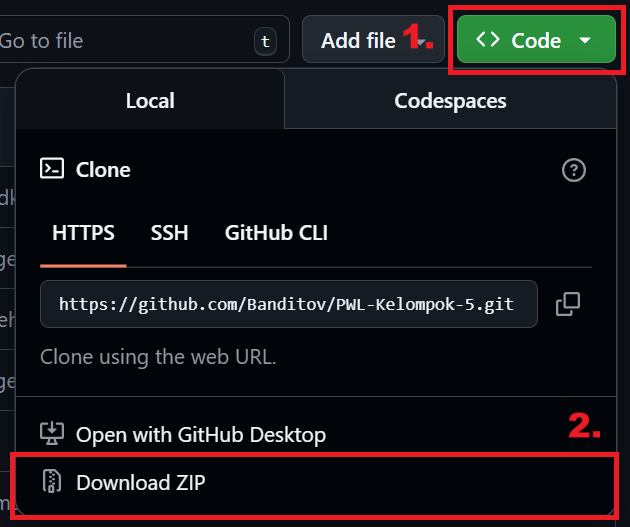
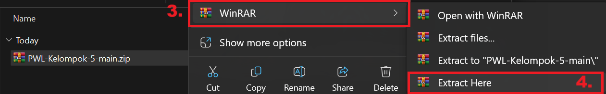
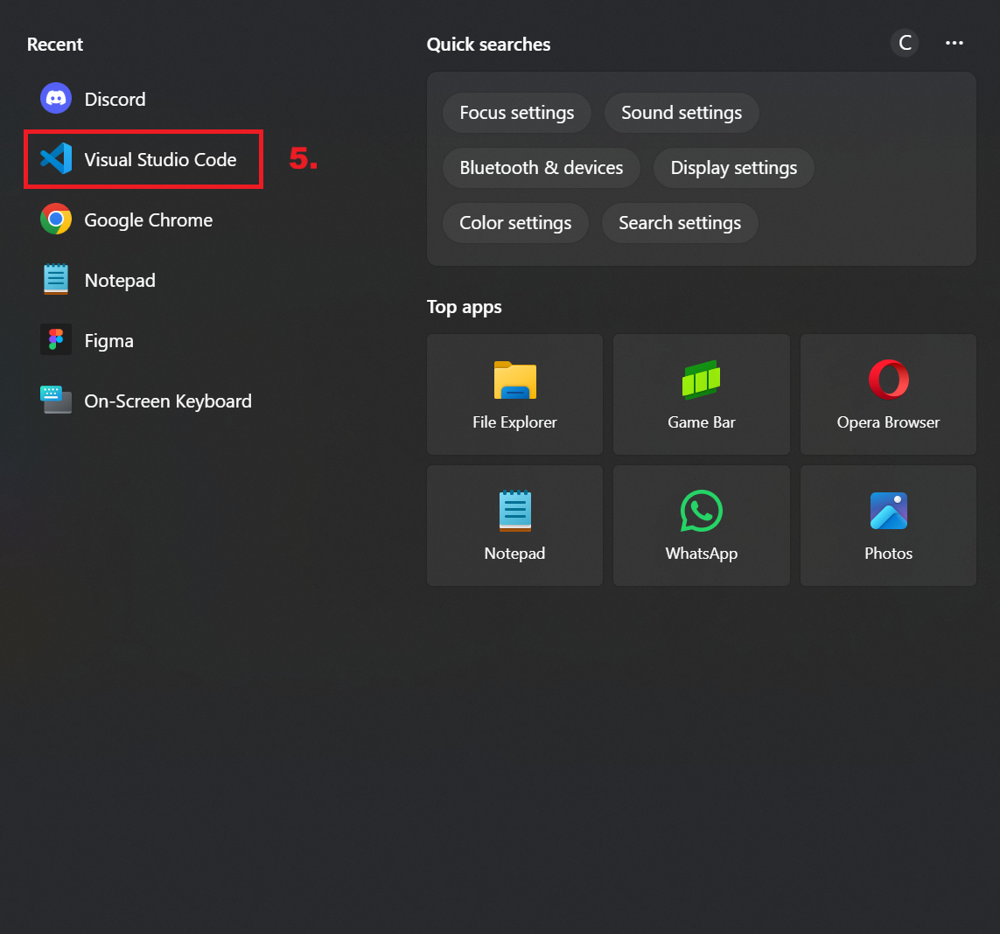
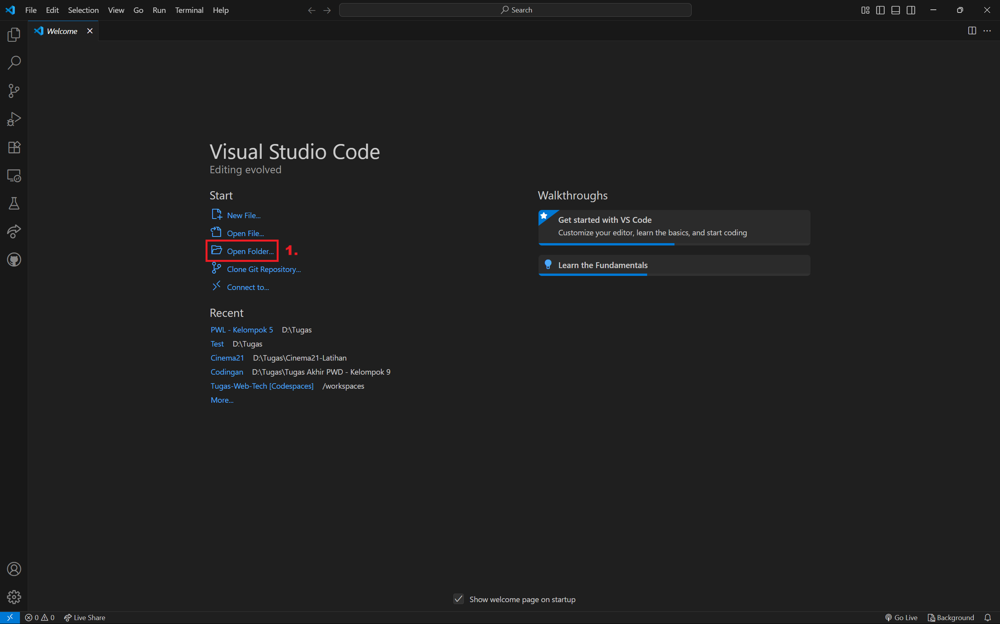
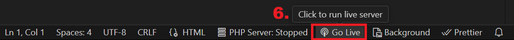

<h1 align="center">ATK SKI</h1>

Sebuah website untuk ATK sekolah khusus SMK Kristen Immanuel.

   
   
   

## Table of Contents
- [Installasi](#installasi)
- [Penggunaan](#penggunaan)
- [Arsitektur](#arsitektur)
- [Kontributor](#kontributor)
- [Lisensi](#lisensi)
- [Change Logs](#changelog)
- [Useful Links](#links)

## Installasi

   
### Step 1

1. Download repository ini (Cari tombol code warna hijau di bagian atas terus tekan "Download ZIP"). 
    
2. Unzip file tersebut dalam sebuah folder. 
    
3. Buka Visual Studio Code. 
    

  
### Step 2.1 (Apabila sudah memiliki plugin Live Server, apabila belum ikut step 2.2)

1. Open folder dimana anda mengekstrak file zip tersebut. 
   
    
2. Buka folder "Home" dan buka "homepage.html". 
    
3. Tekan "Go Live" pada kanan bawah. 
    

### Step 2.2

1. Buka tab extension. 
    
2. Cari extension "Live Server" dan tekan install terus tunggu sampai selesai. 
    

## Penggunaan
Website ATK SKI digunakan sebagai sarana pembelian alat tulis dan buku secara lebih praktis. Guru, siswa, maupun pihak sekolah dapat melihat daftar barang yang tersedia, lengkap dengan informasi harga dan kategori. Dengan adanya fitur keranjang, pengguna bisa memilih beberapa barang sekaligus sebelum melakukan pemesanan. Website ini membantu sekolah mengatur kebutuhan ATK secara lebih cepat, transparan, dan terorganisir tanpa harus melakukan pembelian manual.

## Arsitektur
Front-end Developer  

Back-end Developer  

UI/UX Designer  

## Kontributor
 [Christopher V.C - "Banditov"](https://github.com/Banditov), sebagai ketua & back-end developer. 
 [Nicholas J.G - "nikoe-ee"](https://github.com/nikoe-ee), sebagai front-end developer. 
 [Quinlen M. - "Kuin"](https://github.com/Kuinlin), sebagai UI/UX designer.

## Lisensi
Distributed under the Unlicense License. See [`LICENSE.txt`](./LICENSE.txt) for more information.

## Changelog

### 13/09/2025 - 0.0.1

- Update README.md

### 12/09/2025

- Update README.md
- Memasukin source code home page & login page ke dalam repository

### 11/09/2025

- Update README.md

### 05/09/2025

- Memulai membuat Home Page

### 05/09/2025

- Membuat workflow

### 04/09/2025

- Mengubah logo

### 03/09/2025

- Update README.md
- Tambahkan issue
- Menambahkan logo 

### 02/09/2025

- Update README.md
- Tambahkan license

## Links
- [Figma - Mock-up](https://www.figma.com/design/LLrqwRu8kVeNYoYhqZ2jOe/PWL?node-id=0-1&t=mJ8mLZNfG32KhL0a-1)
- [Figma - Flowchart](https://www.figma.com/board/VeHNnlabuOyT3nS0Fraw8t/Flowchart?node-id=0-1&t=5i79boHm57RZayuk-1)
