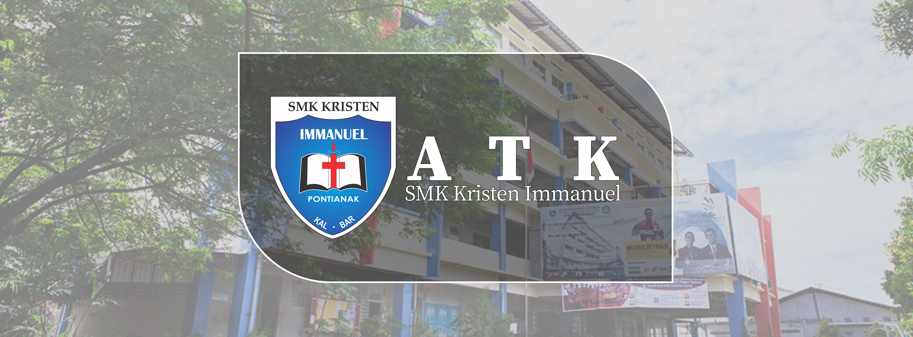
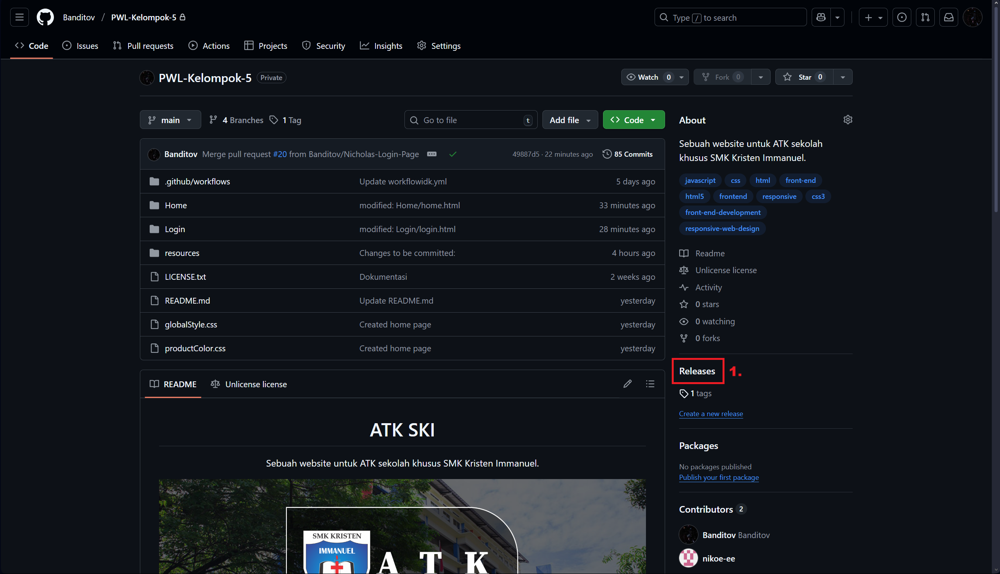
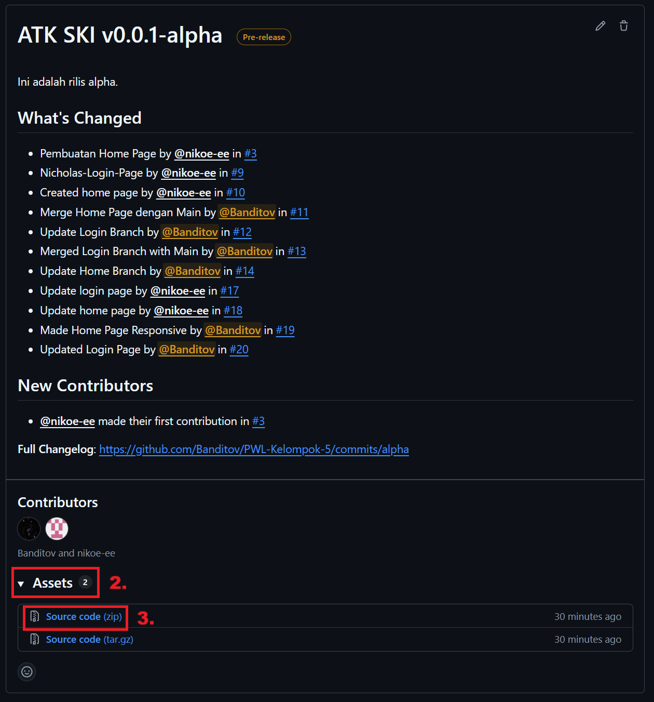
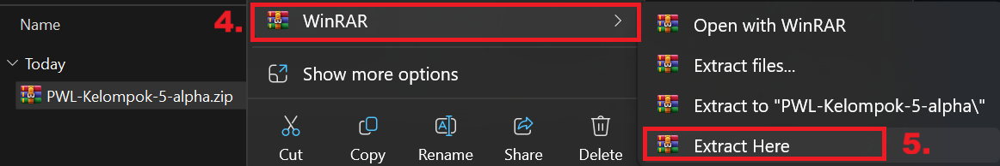
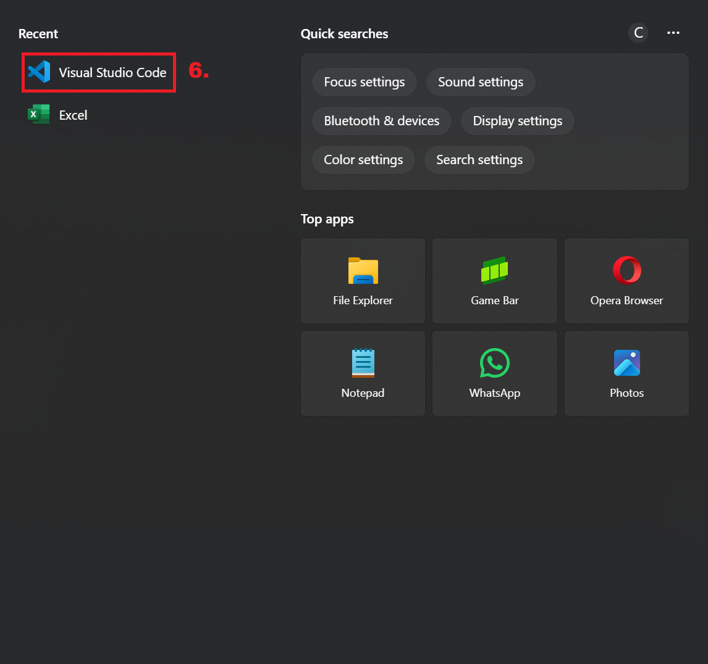
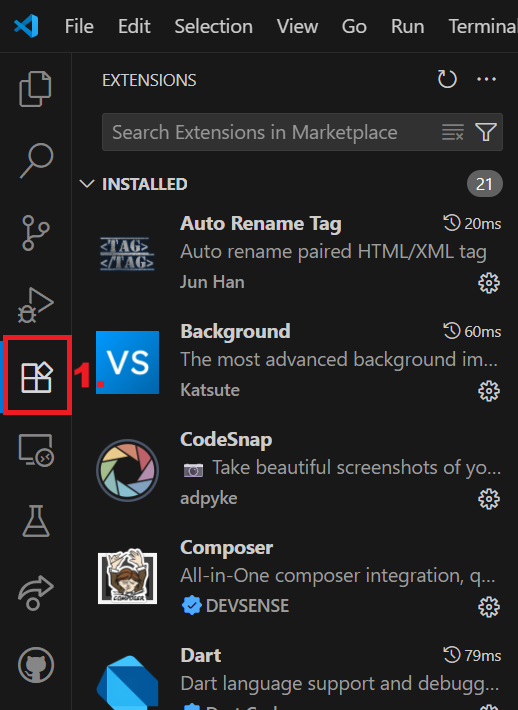
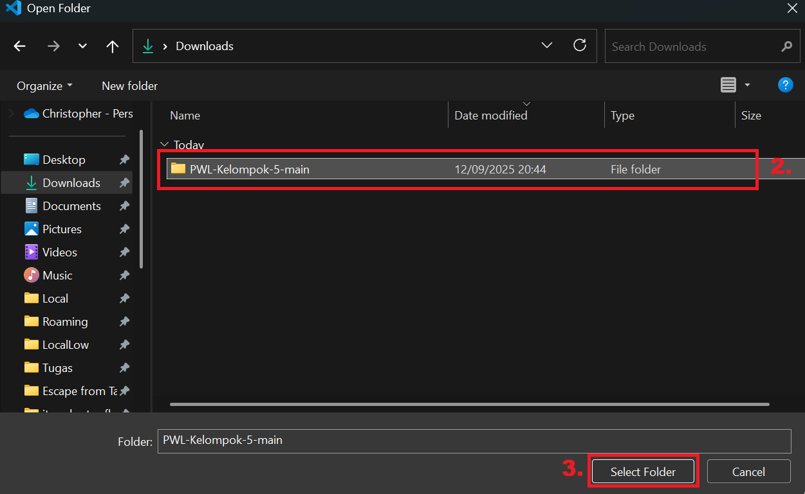
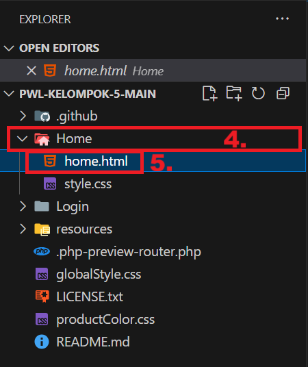

<h1 align="center">ATK SKI</h1>

Sebuah website untuk ATK sekolah khusus SMK Kristen Immanuel.

   
   
   

## Table of Contents

   
Click to Expand

   
- [Installasi](#installasi)
- [Penggunaan](#penggunaan)
- [Arsitektur](#arsitektur)
- [Kontributor](#kontributor)
- [Lisensi](#lisensi)
- [Change Logs](#changelog)
- [Useful Links](#links)

## Installasi

   
Click to Expand

   
### Step 1

   
Pick a Version!
 
   

   
Unstable Version

1. Download repository ini (Cari tombol code warna hijau di bagian atas terus tekan "Download ZIP"). 
    
2. Unzip file tersebut. 
    
3. Buka Visual Studio Code. 
    
4. Lanjut ke Step 2.

   
Stable Version

1. Buka page <a href="https://github.com/Banditov/PWL-Kelompok-5/releases">Releases</a> dari repository ini. 
    
2. Pilih salah satu release, tekan "Assets", dan tekan "Source code (zip)". 
    
3. Unzip file tersebut. 
    
4. Buka Visual Studio Code. 
    
5. Lanjut ke Step 2.

### Step 2 (Ikuti apabila belum memiliki extension Live Server dalam Visual Studio Code)

1. Buka tab extension. 
    
2. Cari extension "Live Server" dan tekan install terus tunggu sampai selesai. 
    
3. Lanjut ke Step 3.

### Step 3

1. Open folder dimana anda mengekstrak file zip tersebut. 
   
    
2. Buka folder "Home" dan buka "homepage.html". 
    
3. Tekan "Go Live" pada kanan bawah. 
    
<h3 align="center">Selesai!</h3>

## Penggunaan
Website ATK SKI digunakan sebagai sarana pembelian alat tulis dan buku secara lebih praktis. Guru, siswa, maupun pihak sekolah dapat melihat daftar barang yang tersedia, lengkap dengan informasi harga dan kategori. Dengan adanya fitur keranjang, pengguna bisa memilih beberapa barang sekaligus sebelum melakukan pemesanan. Website ini membantu sekolah mengatur kebutuhan ATK secara lebih cepat, transparan, dan terorganisir tanpa harus melakukan pembelian manual.

## Arsitektur
Front-end Developer  

Back-end Developer  

UI/UX Designer  

## Kontributor
 [Christopher V.C - "Banditov"](https://github.com/Banditov), sebagai ketua & back-end developer. 
 [Nicholas J.G - "nikoe-ee"](https://github.com/nikoe-ee), sebagai front-end developer. 
 [Quinlen M. - "Kuin"](https://github.com/Kuinlin), sebagai UI/UX designer.

## Lisensi
Distributed under the Unlicense License. See [`LICENSE.txt`](./LICENSE.txt) for more information.

## Changelog

   
Click to Expand

### 14/09/2025 - 0.1.0

- Perubahan nama repository dari "PWL-Kelompok-5" menjadi "XI-TKJ-3_PWL_Kelompok-5"
- Masalah halaman login tidak responsive dengan display Android sudah diperbaiki
- Masalah halaman home tidak responsive dengan display Android sudah diperbaiki
- Perubahan isi dalam README.md

### 13/09/2025 - 0.0.1

- Perubahan README.md
- Halaman home sudah responsive
- Halaman home mendapatkan penambahan isi
- Background halaman login diganti

### 12/09/2025

- Update README.md
- Memasukin source code home page & login page ke dalam repository

### 11/09/2025

- Mengintegrasi CHANGELOG.md dengan README.md

### 05/09/2025

- Membuat workflow
- Memulai pembuatan Home Page

### 04/09/2025

- Mengubah logo

### 03/09/2025

- Update README.md
- Tambahkan issue
- Menambahkan logo 

### 02/09/2025

- Update README.md
- Tambahkan license

## Links
- [Figma - Mock-up](https://www.figma.com/design/LLrqwRu8kVeNYoYhqZ2jOe/PWL?node-id=0-1&t=mJ8mLZNfG32KhL0a-1)
- [Figma - Flowchart](https://www.figma.com/board/VeHNnlabuOyT3nS0Fraw8t/Flowchart?node-id=0-1&t=5i79boHm57RZayuk-1)
