<h1 align="center">ATK SKI</h1>

Sebuah website untuk ATK sekolah khusus SMK Kristen Immanuel.

   
    
   
     
   
Deploys

   
    

## Table of Contents

   
Click to Expand

   
- [Instalasi](#instalasi)
- [Penggunaan](#penggunaan)
- [Fitur Utama](#fitur-utama)
- [Entitas](#entitas)
- [Cara Login](#cara-login)
- [Arsitektur](#arsitektur)
- [Kontributor](#kontributor)
- [Lisensi](#lisensi)
- [Changelog](#changelog)
- [Link](#link)

## Instalasi

   
Instalasi

<!-- Instalasi Baru -->

   
Versi Beta & Release
  

   
Lokal

### Step 1

   
Pilih Versi
 

   

      
Unstable Version

1. Download repository ini (Cari tombol code warna hijau di bagian atas terus tekan "Download ZIP").
      

         
Step 1A-1

         
      

2. Ekstrak file tersebut.
      

         
Step 1A-2

         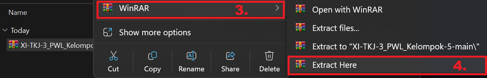
      

3. Pindahkan folder "XI-TKJ-3_PWL_Kelompok-5" ke directory "C:\laragon\www\".
      

         
Step 1A-3

         
      

4. Buka Laragon.
      

         
Step 1A-4

         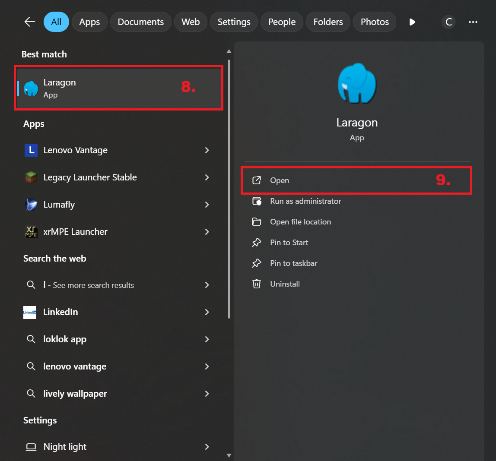
      

5. Tekan "Start All" dan tekan "Database".
      

         
Step 1A-5

         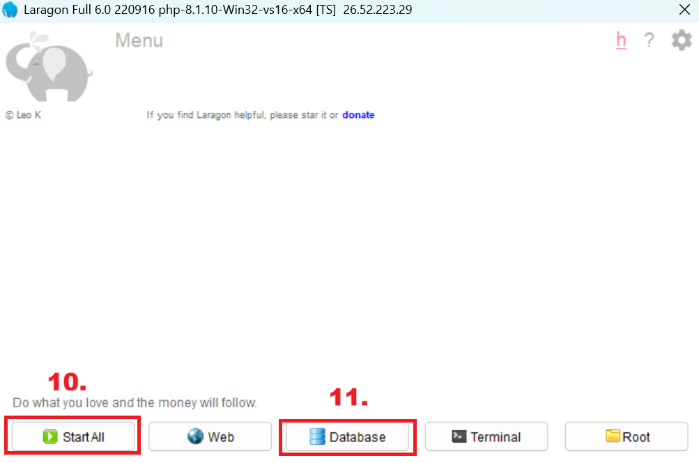
      

6. Login ke phpMyAdmin menggunakan username "root" dan password kosong.
      

         
Step 1A-6

         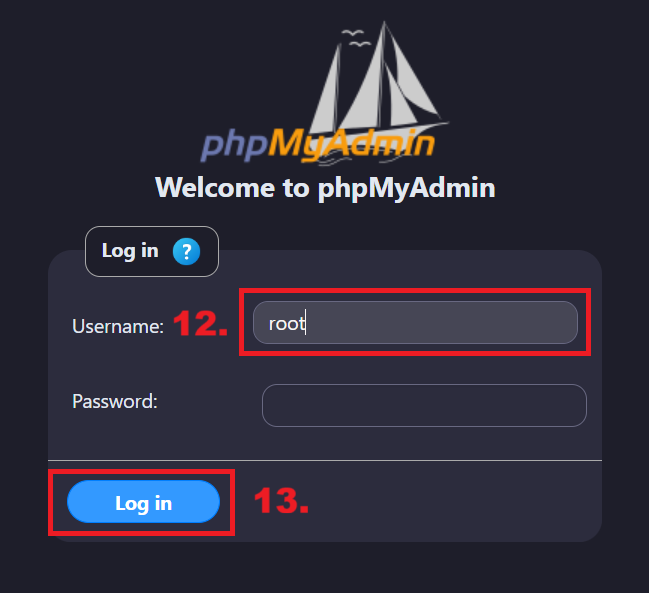
      

7. Buat database dengan nama "atkski".
      

         
Step 1A-7

         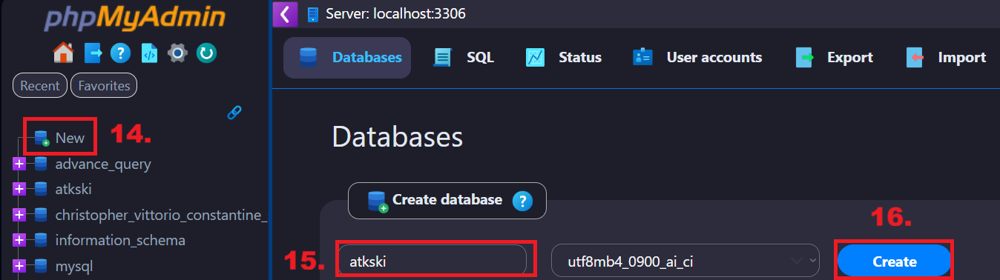
      

8. Import file "atkski.sql" yang terdapat di dalam folder yang telah dipindahkan.
      

         
Step 1A-8

         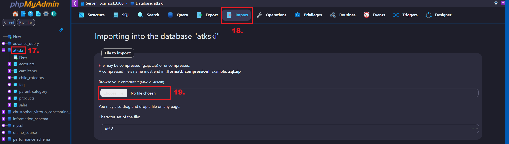
         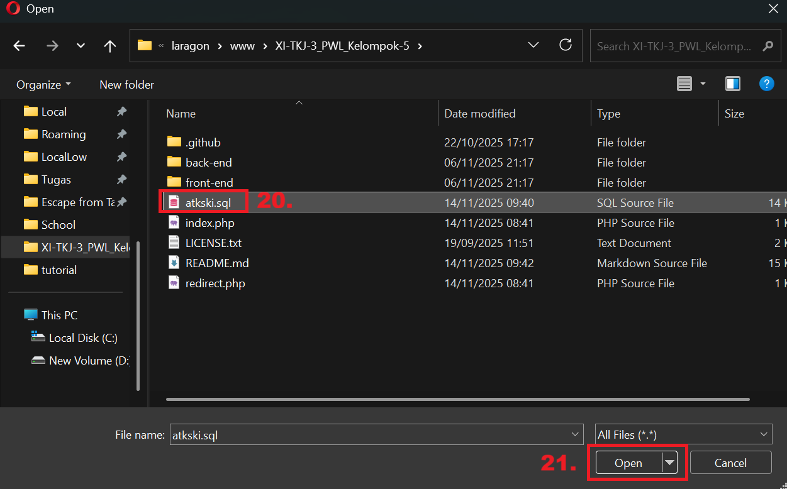
         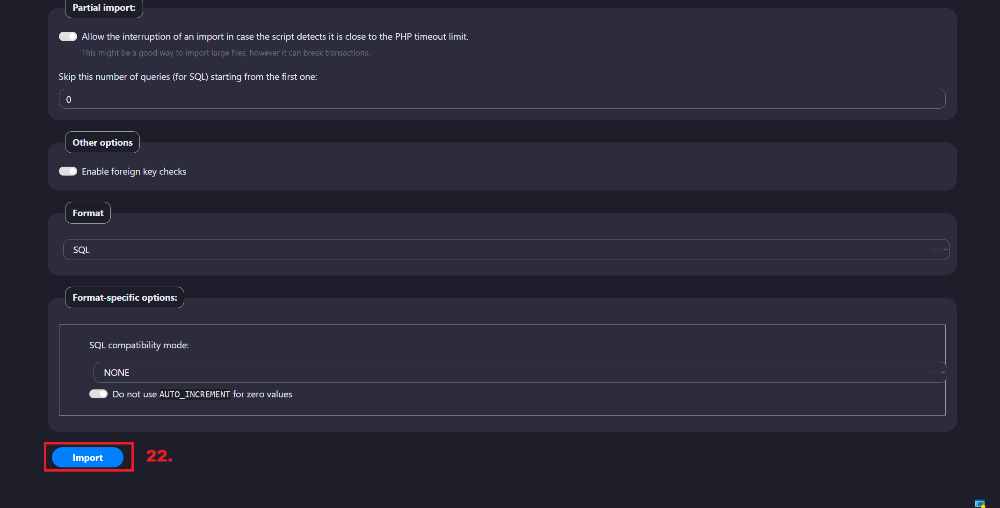
      

9. Lanjut ke Step 2.
   

 
   

      
Stable Version

1. Buka page <a href="https://github.com/Banditov/XI-TKJ-3_PWL_Kelompok-5/releases">Releases</a> dari repository ini.
      

         
Step 1B-1

         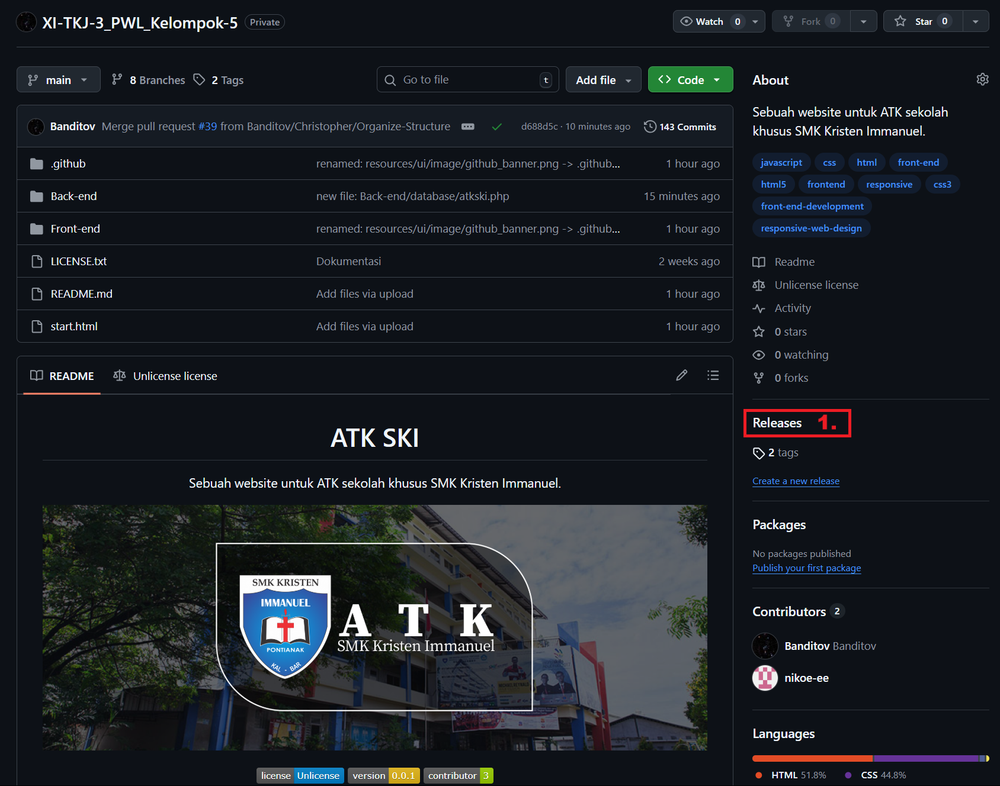
      

2. Pilih salah satu release, tekan "Assets", dan tekan "Source code (zip)".
      

         
Step 1B-2

         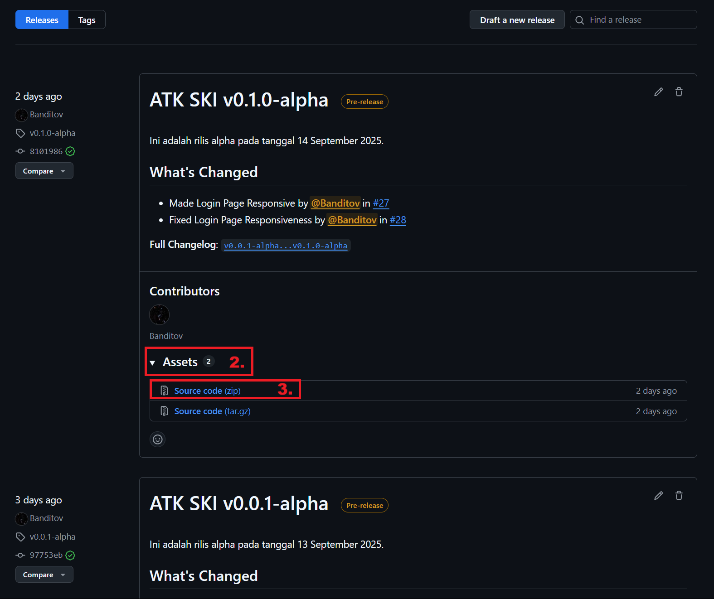
      

3. Ekstrak file tersebut.
      

         
Step 1B-3

         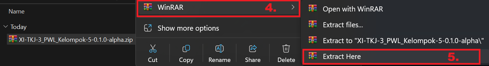
      

4. Pindahkan folder "XI-TKJ-3_PWL_Kelompok-5" ke directory "C:\laragon\www\".
      

         
Step 1B-4

         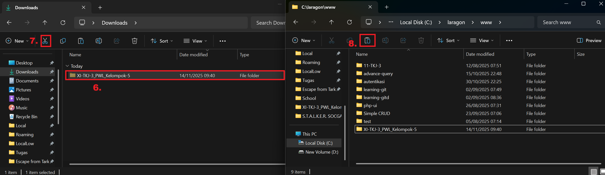
      

5. Buka Laragon.
      

         
Step 1B-5

         
      

6. Tekan "Start All" dan tekan "Database".
      

         
Step 1B-6

         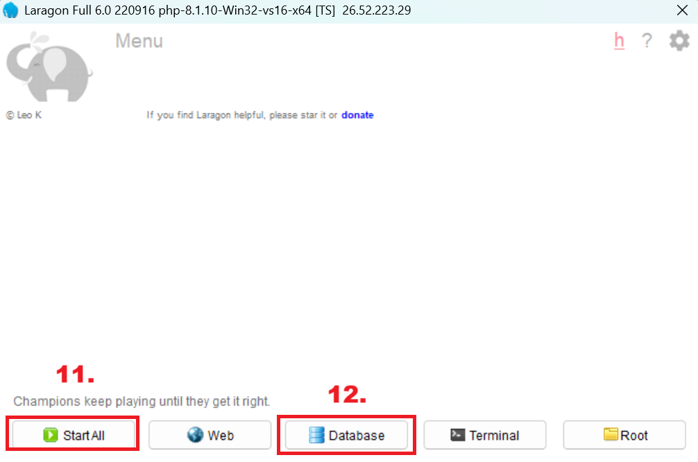
      

7. Login ke phpMyAdmin menggunakan username "root" dan password kosong.
      

         
Step 1B-7

         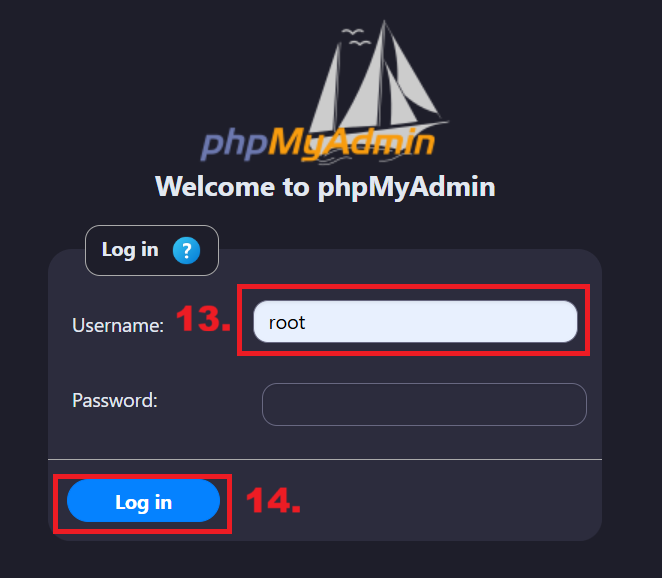
      

8. Buat database dengan nama "atkski".
      

         
Step 1B-8

         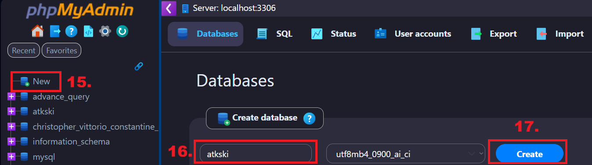
      

9. Import file "atkski.sql" yang terdapat di dalam folder yang telah dipindahkan.
      

         
Step 1B-9

         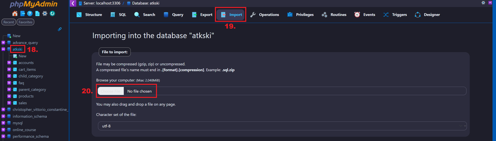
         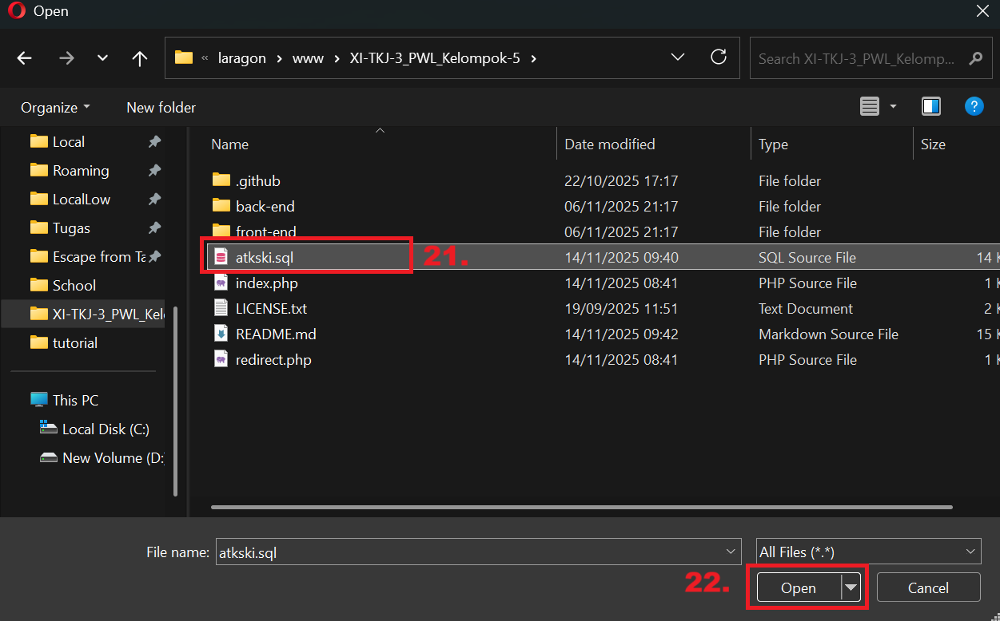
         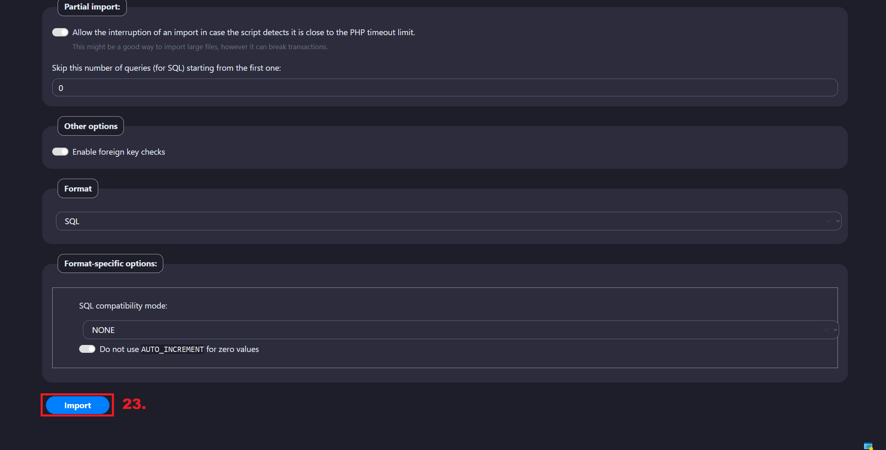
      

10. Lanjut ke Step 2.
   

### Step 2

   
Step 2

1. Buka terminal di Laragon.
      

         
Step 2-1

         
      

2. Ketikkan "cd XI-TKJ-3_PWL_Kelompok-5".
      

         
Step 2-2

         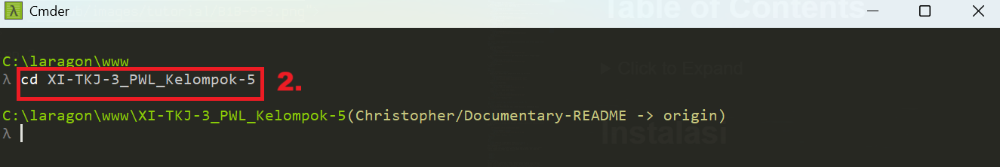
      

3. Ketikkan "php -S localhost:5500" dan tekan link yang diberikan sambil menekan ctrl kiri.
      

         
Step 2-3

         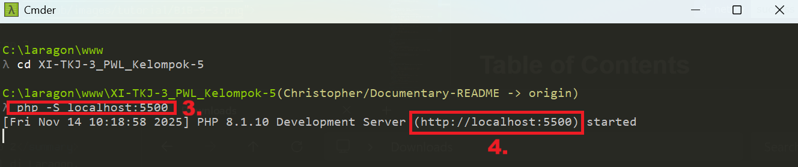
      

   <h3 align="center">Selesai!</h3>

  

   
Online

<a href="https://atkski.yzz.me">Tekan aku!</a> 
Note tambahan: 
Website ini memiliki beberapa masalah dengan stylenya (css) yang tidak terlihat pada versi lokal. Selain itu, website ini berfungsi seperti lokal. :)

  

<!-- Instalasi Lama -->

   
Versi Alpha
 

   
Pilih antara instalasi secara lokal atau online
 

   
Lokal

   
### Step 1

   
Pilih Versi
 
   

   
Unstable Version

1. Download repository ini (Cari tombol code warna hijau di bagian atas terus tekan "Download ZIP").
   

      
Step 1A-1

      
   

2. Unzip file tersebut.
   

      
Step 1A-2

      
   

3. Buka Visual Studio Code.
   

      
Step 1A-3

      
   

4. Lanjut ke Step 2.

 

   
Stable Version

1. Buka page <a href="https://github.com/Banditov/XI-TKJ-3_PWL_Kelompok-5/releases">Releases</a> dari repository ini.
   

      
Step 1B-1

      
   

2. Pilih salah satu release, tekan "Assets", dan tekan "Source code (zip)".
   

      
Step 1B-2

      
   

3. Unzip file tersebut.
   

      
Step 1B-3

      
   

4. Buka Visual Studio Code.
   

      
Step 1B-4

      
   

5. Lanjut ke Step 2.

### Step 2 (Ikuti apabila belum memiliki extension Live Server dalam Visual Studio Code)

   
Step 2

1. Buka tab extension.
   

      
Step 2-1

      
   

2. Cari extension "Live Server" dan tekan install terus tunggu sampai selesai.
   

      
Step 2-2

      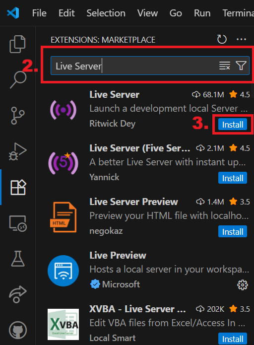
   

3. Lanjut ke Step 3.

### Step 3

   
Step 3

1. Open folder dimana kamu mengekstrak file zip tersebut.
   

      
Step 3-1

      
      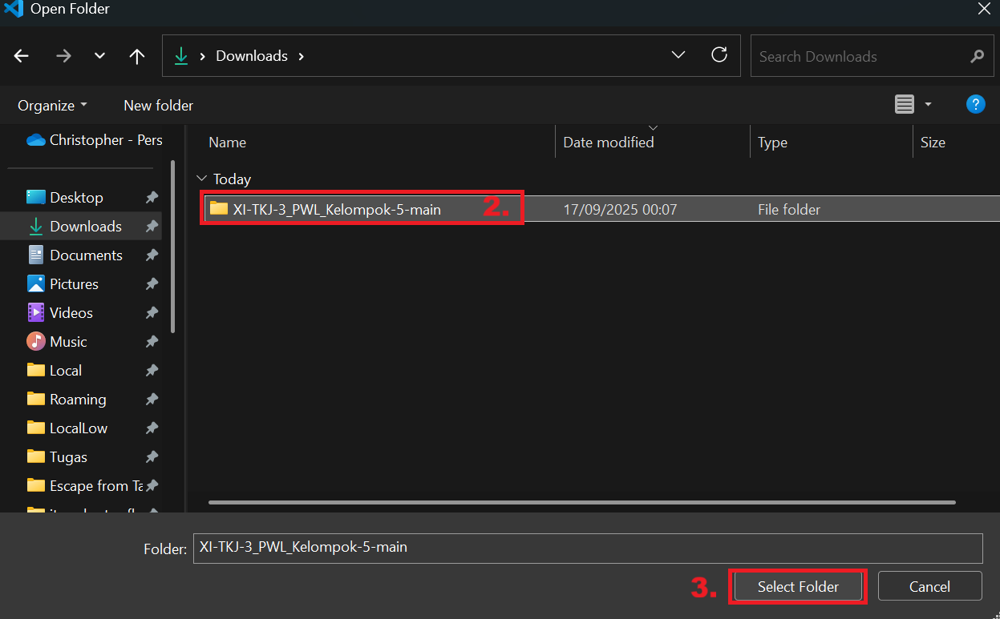
   

2. Buka file "start.html".
   

      
Step 3-2

      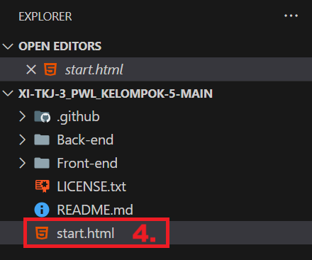
   

3. Tekan "Go Live" pada kanan bawah.
   

      
Step 3-3

      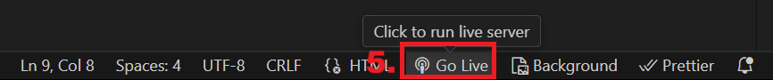
   

<h3 align="center">Selesai!</h3>

### Step 4 (Apabila ingin membuka website ini di HP)

   
Step 4

1. Cari private IPv4 komputer kamu (Dapat dicari di properties wifi)
   

      
Step 4-1

      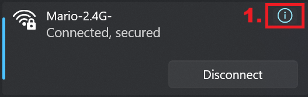
      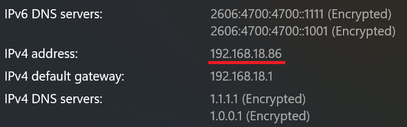
   

2. Cari port dari server
   

      
Step 4-2

      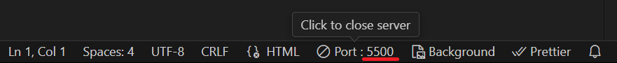
   

3. Buka browser di HP kamu dan masukin informasi yang sudah didapati dengan format 
   
   `(IP Komputer):(Port Server)/start.html`
   

      
Contoh

      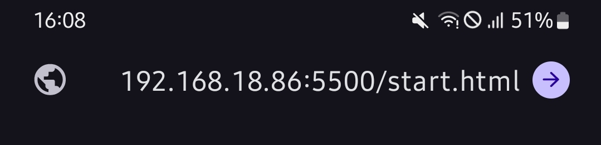
   

<h3 align="center">Selesai!</h3>

 

   
Online (Tidak perlu install)

<a href="https://atkski.netlify.app">Tekan aku!</a> 
Note tambahan: 
Website lewat link ini mungkin tidak up-to-date dengan versi rilis dalam GitHub (Dapat cek badge versi Netlify pada bagian atas) dan juga ada kemungkinan website ini tidak online.
   

## Penggunaan
Website ATK SKI digunakan sebagai sarana pembelian alat tulis dan buku secara lebih praktis. Guru, siswa, maupun pihak sekolah dapat melihat daftar barang yang tersedia, lengkap dengan informasi harga dan kategori. Dengan adanya fitur keranjang, pengguna bisa memilih beberapa barang sekaligus sebelum melakukan pemesanan. Website ini membantu sekolah mengatur kebutuhan ATK secara lebih cepat, transparan, dan terorganisir tanpa harus melakukan pembelian manual.

## Fitur Utama

   
Berikut ini adalah fitur-fitur utama yang terdapat pada setiap page pada website ATK SKI:

- Login

  Seperti dari nama halamannya, halaman ini hanya memiliki fitur login. Apabila pengguna mencoba untuk memasuki halaman lain secara paksa tanpa login, maka pengguna akan diredirect kembali ke halaman ini.

- Home

   Pada halaman home, kita dapat menemukan produk-produk yang esensial pada sekolah kita dan langsung menambahkan produk-produk tersebut ke dalam cart. Dalam kata lain, page ini digunakan untuk memberikan "shortcut" bagi para pengguna yang hanya ingin membeli produk penting sekolah.

- Products

   Pada halaman products, kita dapat menemukan semua produk-produk yang dijual oleh ATK sekolah kita. Halaman ini juga memiliki fitur filter pada bagian kiri untuk menolong pengguna mencari produk mereka.

- Cart

   Halaman ini adalah dimana kita dapat melihat produk-produk yang telah ingin kita pesan. Disini kita juga dapat mengubah kuantitas dari produk-produk yang ingin kita beli dan melihat harga total dari pesanan kita.

- History

   Fungsi dari halaman ini hanya satu, yaitu memperlihatkan riwayat pembelian mereka. Halaman ini juga memiliki fitur search untuk menolong pengguna mencari pesanan tertentu.

- Status

   Halaman ini digunakan untuk memeriksa proses dari pesanan kita dan juga dimana kita dapat membatalkan pesanan kita.

- Profile

   Halaman ini hanya memiliki satu fungsi, log out. Setelah log out, pengguna akan diredirect kembali ke halaman login.

- FAQ

   Pada halaman ini, para pengguna dapat mencari jawaban dari pertanyaan yang mereka inginkan.

   

      
Admin Pages

  - Register
 
    Digunakan untuk menambahkan akun.

  - Status Changer
 
    Digunakan untuk mengubah status dari semua pesanan.

  - Stock Changer
 
    Digunakan untuk mengubah stok dari produk-produk.

   

  

## Entitas

   
Entitas Database

   

      
accounts

      Entitas ini digunakan untuk menyimpan akun-akun
      
      - id // Untuk mengidentifikasi sebuah akun
      - name // Untuk menyimpan username akun
      - email // Untuk menyimpan email akun
      - password // Untuk menyimpan password akun
      - class // Untuk menyimpan kelas dari pengguna akun
      - is_admin // Untuk menentukan akun admin atau tidak
      
   

   

      
cart_items

      Entitas ini digunakan untuk menyimpan produk-produk yang terdapat dalam cart

      - id // Untuk mengidentifikasi sebuah item
      - account_id // Untuk mengidentifikasi item punya siapa
      - product_id // Untuk mengidentifikasi item yang terdapat dalam cart
      - quantity // Untuk mengisi kuantitas dari item tersebut
      
   

   

      
child_category

      Entitas ini digunakan untuk menyimpan kategori-kategori child untuk filter pada page produk

      - id // Untuk mengidentifikasi sebuah kategori child
      - name // Untuk menyimpan nama dari kategori child
      - parent_id // Untuk mengidentifikasi parent dari kategori child
      
   

   

      
faq

      Entitas ini digunakan untuk menyimpan pertanyaan dan jawaban pada page FAQ

      - id // Untuk mengidentifikasi sebuah row FAQ
      - question // Untuk menyimpan pertanyaan
      - answer // Untuk menyimpan jawaban
      
   

   

      
orders

      Entitas ini digunakan untuk menyimpan informasi dari sebuah pesanan

      - id // Untuk mengidentifikasi sebuah pesanan
      - order_number // Untuk menyimpan kode pesanan
      - customer_id // Untuk mengidentifikasi akun dari pesanan
      - total_amount // Untuk menyimpan total harga dari pesanan
      - order_date // Untuk menyimpan tanggal dari pesanan
      - status // Untuk menyimpan status pesanan
      - act // Untuk menyimpan proses yang sedang dilakukan pada pesanan
      - isnt_shown // Untuk mengidentifikasi pesanan ini ditampilkan pada status page atau tidak
      
   

   

      
parent_category

      Entitas ini digunakan untuk menyimpan kategori-kategori parent untuk filter pada page produk

      - id // Untuk mengidentifikasi sebuah kategori parent
      - name // Untuk menyimpan nama dari kategori parent
      
   

   

      
products

      Entitas ini digunakan untuk menyimpan produk-produk

      - id // Untuk mengidentifikasi sebuah produk secara individual (tiap produk dengan warna berbeda memiliki id sendiri)
      - product_id // Untuk mengidentifikasi produk yang sama
      - product_name // Untuk menyimpan nama produk
      - stock // Untuk menyimpan stok dari produk
      - price // Untuk menyimpan harga dari sebuah produk
      - image // Untuk menyimpan kode foto produk
      - color // Untuk menyimpan warna produk
      - category_parent_id // Untuk mengidentifikasi kategori parent produk
      - category_id // Untuk mengidentifikasi kategori child produk
      - is_first // Untuk menentukan default yang akan ditampilkan pada card produk
      
   

   

      
sales

      Entitas ini digunakan untuk menyimpan informasi tambahan dari pesanan

      - id // Untuk mengidentifikasi row pada database
      - order_id // Untuk mengidentifikasi pesanan dari data
      - customer_id // Untuk mengidentifikasi akun dari data
      - product_id // Untuk mengidentifikasi produk dari data
      - quantity // Untuk menyimpan kuantitas pembelian
      - price // Untuk menyimpan total dari pembelian singularitas produk
      
   

## Cara Login

   
Cara login

  Untuk login ke dalam akun siswa, format password adalah 2 digit pertama dari nama depan dan angka dari email mereka.
  > Contoh password menggunakan akun `christopher.001@ski.sch.id` : `ch001`

  Untuk login ke dalam akun guru atau staff, format password adalah nama depan.
  > Contoh password menggunakan akun `richard_m@ski.sch.id` : `richard`

  Untuk menggunakan akun admin, login menggunakan email `admin@ski.sch.id` atau `vinska@ski.sch.id`. Password dari akun `admin@ski.sch.id` adalah `admin123`.

## Arsitektur
<b>-- Front-end Development --</b>  

<b>-- Back-end Development --</b>  

<b>-- UI/UX Design --</b>  

<b>! -- Proyek Terpisah -- !</b>  
Hosting Provider telah diganti dari `Netlify` jadi `free-hosting.org`  

## Kontributor
 [Christopher V.C - "Banditov"](https://github.com/Banditov), sebagai ketua & back-end developer. 
 [Nicholas J.G - "nikoe-ee"](https://github.com/nikoe-ee), sebagai front-end developer. 
 [Quinlen M. - "Kuin"](https://github.com/Kuinlin), sebagai UI/UX designer.

## Lisensi
Distributed under the Unlicense License. See [`LICENSE.txt`](./LICENSE.txt) for more information.

## Changelog

   
Click to Expand

   
November

      
### 24/11/2025 - 1.1.0 ( Release )

   - Bug ketika user melupakan orderan dan admin tidak dapat melihat orderan telah diperbaiki
   - Halaman order viewer telah dibuat

### 22/11/2025 - 1.0.0 ( Release )

   - Database diperbarui dengan produk tambahan
   - Ikon notifikasi akan memberikan tanda apabila ada orderan yang sudah siap
   - Menambahkan beberapa animasi saat hover
   - Fungsi pengganti warna pada card produk telah diperbarui agar lebih intuitif
   - Responsivitas page login/register telah diperbarui
   - Kebanyakan teks telah ditranslasikan ke bahasa Indonesia
   - Proyek ini telah dihost pada `free-hosting.org`

### 21/11/2025 - 1.0.0 ( WIP )

   - Penambahan bagian fitur utama, cara login dan entitas pada README
   - Beberapa aksi telah ditambahkan sebuah konfirmasi
   - Beberapa masalah dan inkonsistensi kode telah diperbaiki
   - Page-page untuk admin telah dibuat.

### 20/11/2025 - 1.0.0 ( WIP )

   - Page profile telah dibuat

### 19/11/2025 - 0.4.1 ( Release )

   - Database telah diupdate

  
### 18/11/2025 - 0.4.0 ( Release )

   - Halaman history telah dibuat
   - Fungsi ordering telah ditambahkan
   - Fungsi pada status page sudah bekerja

### 16/11/2025 - 0.4.0 ( WIP )

   - Perbaikan README

### 14/11/2025 - 0.4.0 ( WIP )

   - README.md diupdate, menambahkan bagian fitur utama & update instalasi

### 13/11/2025 - 0.3.0 ( Release )

   - Desain banner telah diganti

### 12/11/2025 - 0.3.0 ( WIP )

   - Halaman cart telah dibuat
   - Fitur add to cart telah ditambahkan

### 11/11/2025 - 0.3.0 ( WIP )

   - Struktur image telah diupdate

### 6/11/2025 - 0.3.0 ( WIP )

   - Database telah diupdate
   - Page produk telah dibuat
   - Branch baru untuk pre-deploy telah dibuat

### 5/11/2025 - 0.3.0 ( WIP )

   - Beberapa animasi kecil telah ditambahkan
   - Page produk telah dibuat

  
### 4/11/2025 - 0.3.0 ( WIP )

   - Page FAQ telah dibuat ulang

  
### 3/11/2025 - 0.3.0 ( WIP )

   - Beberapa bug fix
   - Menambahkan intro

   
October

### 31/10/2025 - 0.3.0 ( WIP )

   - Loading screen sudah responsif

### 30/10/2025 - 0.3.0 ( WIP )

   - Fitur checkbox warna telah ditambahkan
   - Page FAQ sudah responsif
   - Halaman login sudah terintegrasi dengan database
   - Beberapa masalah telah diperbaiki

### 24/10/2025 - 0.3.0 ( WIP )

   - Page FAQ telah dibuat

### 23/10/2025 - 0.3.0 ( WIP )

   - Database telah terhubung dengan halaman home
   - Home telah dibagi menjadi berbagai komponen terpisah

### 22/10/2025 - 0.3.0 ( WIP )

   - Database terintegrasi dengan halaman home
   - Halaman home dibagi menjadi beberapa komponen

   
September

### 21/09/2025 - 0.3.0 ( WIP )

   - Penghapusan Laravel dari arsitektur
   - Struktur telah direorganisir

### 21/09/2025 - 0.3.0 ( WIP )

   - Tambahan ikon pada tab browser

### 21/09/2025 - 0.2.1 ( Release )

   - Penambahan instruksi penggunaan secara online & mobile

### 18/09/2025 - 0.2.1 ( WIP )

   - Beberapa masalah kecil diperbaiki

### 18/09/2025 - 0.2.1 ( WIP )

   - Branch baru untuk belajar React.JS dibuat
   - Deploy website menggunakan Netlify

### 17/09/2025 - 0.2.1 ( WIP )

   - Perbaiki masalah responsivity halaman home apabila zoom keluar

### 17/09/2025 - 0.2.0 ( Release )

   - Pembaruan instruksi instalasi

### 16/09/2025 - 0.2.0 ( WIP )

   - Perubahan struktur
   - Penambahan file starter
   - Penambahan drop-down pada gambar tutorial dalam README.md
   - Penambahan database

### 14/09/2025 - 0.1.0 ( Release )

   
   - Perubahan nama repository dari "PWL-Kelompok-5" menjadi "XI-TKJ-3_PWL_Kelompok-5"
   - Masalah halaman login tidak responsive dengan display Android sudah diperbaiki
   - Masalah halaman home tidak responsive dengan display Android sudah diperbaiki
   - Perubahan isi dalam README.md

### 13/09/2025 - 0.0.1 ( Release )

   - Perubahan README.md
   - Halaman home sudah responsive
   - Halaman home mendapatkan penambahan isi
   - Background halaman login diganti

### 12/09/2025

   - Update README.md
   - Memasukin source code home page & login page ke dalam repository

### 11/09/2025

   - Mengintegrasi CHANGELOG.md dengan README.md

### 05/09/2025

   - Membuat workflow
   - Memulai pembuatan Home Page

### 04/09/2025

   - Mengubah logo

### 03/09/2025

   - Update README.md
   - Tambahkan issue
   - Menambahkan logo 

### 02/09/2025

   - Update README.md
   - Tambahkan license

## Link
- [Figma - Mock-up](https://www.figma.com/design/LLrqwRu8kVeNYoYhqZ2jOe/PWL?node-id=0-1&t=mJ8mLZNfG32KhL0a-1)
- [Figma - Flowchart](https://www.figma.com/board/VeHNnlabuOyT3nS0Fraw8t/Flowchart?node-id=0-1&t=5i79boHm57RZayuk-1)
- [Netlify](https://atkski.netlify.app)
- [Free-Hosting.org](https://atkski.yzz.me)

<!-- 
https://img.shields.io/badge/free--hosting.org-r1.1.0-127AF9?style=flat&logo=
-->
