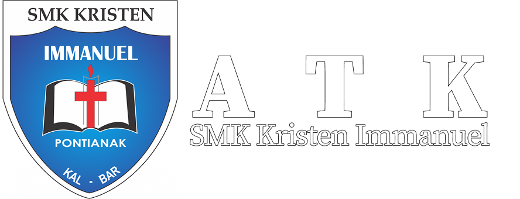

### PWL Kelompok 5
# ATK SKI

Sebuah website untuk ATK sekolah khusus SMK Kristen Immanuel

## Table of Contents
- [Installasi](#installasi)
- [Penggunaan](#penggunaan)
- [Arsitektur](#arsitektur)
- [Change Logs](#changelog)
- [Kontributor](#kontributor)
- [License](#license)

## Installasi
### Step 1
1. Download repository ini (Cari tombol code warna hijau di bagian atas terus tekan "Download ZIP").
2. Unzip file tersebut dalam sebuah folder.

### Step 2.1 (Apabila sudah memiliki plugin Live Preview, apabila belum ikut step 2.2)
1. Buka Visual Studio Code.
2. Open folder dimana anda mengekstrak file zip tersebut.
3. Buka file "homepage.php".
4. Right-click isi dari source codenya.
5. Tekan "Open with Live Server".

### Step 2.2
1. Buka Visual Studio Code.
2. Buka tab extension.
3. Cari extension "Live Server".
4. Tekan install & tunggu sampai selesai.
5. Setelah sudah selesai, restart Visual Studio Code & ikuti step 2.1.

## Penggunaan
  Website ATK SKI digunakan sebagai sarana pembelian alat tulis dan buku secara lebih praktis. Guru, siswa, maupun pihak sekolah dapat melihat daftar barang yang tersedia, lengkap dengan informasi harga dan kategori. Dengan adanya fitur keranjang (cart), pengguna bisa memilih beberapa barang sekaligus sebelum melakukan pemesanan. Website ini membantu sekolah mengatur kebutuhan ATK secara lebih cepat, transparan, dan terorganisir tanpa harus melakukan pembelian manual.

## Arsitektur
Front-end Developer  

Back-end Developer  

UI/UX Designer  

## Changelog
See `CHANGELOG.md` for the information.

## Kontributor
- [Christopher V.C - "Banditov"](https://github.com/Banditov), sebagai ketua & back-end developer.
- [Nicholas J.G - "nikoe-ee"](https://github.com/nikoe-ee), sebagai front-end developer.
- [Quinlen M. - "Kuin"](https://github.com/Kuinlin), sebagai UI/UX designer.

## License
Distributed under the Unlicense License. See `LICENSE.txt` for more information.

## Link Terkait Website Ini
- [Figma - Mock-up](https://www.figma.com/design/LLrqwRu8kVeNYoYhqZ2jOe/PWL?node-id=0-1&t=mJ8mLZNfG32KhL0a-1)
- [Figma - Flowchart](https://www.figma.com/board/VeHNnlabuOyT3nS0Fraw8t/Flowchart?node-id=0-1&t=5i79boHm57RZayuk-1)
